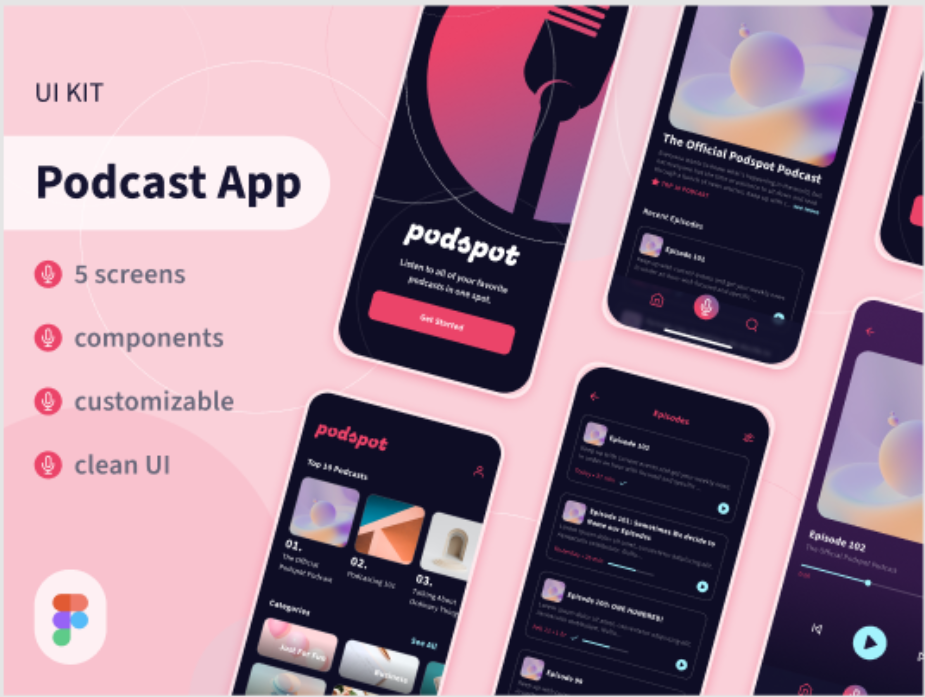
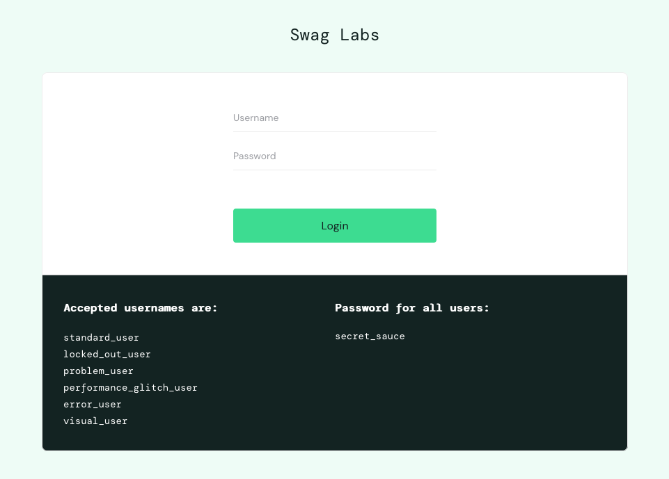

# Portfólio QA: Análise de Requisitos e Plano de Testes

Bem-vindes ao meu portfólio dedicado à Qualidade de Software, com foco em duas áreas cruciais: Análise de Requisitos e Planejamento de Testes.

Este projeto tem a finalidade de mostrar os estudos práticos em Análise de Requisitos e Plano de Teste, garantindo que as soluções entregues atendam às necessidades dos usuários e aos objetivos de negócio.

O que você encontrará neste repositório:

- **Análise de Requisitos:** Descrevem as necessidades e expectativas dos stakeholders a partir de um protótipo inicial. Aqui, você verá como identifiquei e estruturei as funcionalidades do projeto, incluindo as Regras de Negócio essenciais para o seu funcionamento.
   
- **Plano de Teste:** Definem a estratégia e os critérios para testar o sistema. Este plano reflete uma visão abrangente para a validação da qualidade do sistema.
   
- **User Stories (Histórias de Usuário):** Representações das funcionalidades sob a perspectiva do usuário, elaboradas para facilitar a compreensão e a colaboração entre as equipes de produto, desenvolvimento e QA.
   
- **Critérios de Aceite (BDD/Gherkin):** Definições precisas das condições que uma funcionalidade deve satisfazer para ser considerada concluída e aceita. Utilizo a linguagem Gherkin (Dado/Quando/Então) para garantir clareza, automação potencial e alinhamento entre todos os envolvidos.

## Portfólio Análise de Requisitos 

 - prototipo do figma: [PodcastApp](https://www.figma.com/design/ECIzSfAWHcPJSi3HxkKdUr/PodcastAppChallenge?m=auto&t=WBSxPDFw8EJ0oCFy-1)

 ## Portfolio Plano de Teste

 - Site utilizado para elaboração do plano: [Saucedemo](https://saucedemo.com/)

